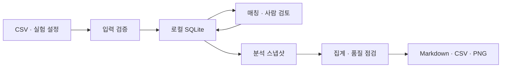

# 노래차트 — 아키텍처와 데이터 계약

상위 문서: [[00_노래차트_개발기획]]. **구현 예정 계약 v0.1**이며 실행 가능한 코드나 존재하는 CLI가 아니다.

## 1. 구조와 기술 선택



CLI와 후속 화면은 같은 application 서비스를 호출한다. 집계 함수는 파일·DB·네트워크에 직접 접근하지 않고 검증된 입력을 받아 결과를 반환한다.

| 계층 | 담당 | v0.1 선택 |
|---|---|---|
| domain | 라벨·분모·가중치·검증 규칙 | Python 함수와 명시적 데이터 모델 |
| application | 가져오기·검토·스냅샷·보고서 실행 | 명시적 작업 서비스 |
| storage | 트랜잭션·버전·조회 | SQLite와 표준 sqlite3 |
| importers | CSV를 공통 형식으로 변환 | CSV만 먼저 구현 |
| analysis | 집계·민감도 비교 | pandas 또는 작은 순수 함수 |
| reporting | 표·그래프·manifest | Markdown 템플릿, Matplotlib |
| interfaces | 사용자 입력 | CLI 우선, 후속 로컬 웹 화면 |

Python 배포판·패키지 버전은 구현 시작 시 호환되는 조합으로 고정한다. 현재 문서에 최신 버전 번호를 임의로 박지 않는다. SQLite는 별도 서버 없이 파일 기반으로 사용할 수 있고 Python 인터페이스가 제공된다. [Python 공식 문서](https://docs.python.org/3/library/sqlite3.html)

CSV 타입·인코딩·빈값 처리는 명시적으로 설정한다. 그래프는 비대화형 렌더링으로 파일을 출력하고 한글 글꼴을 환경 점검에 포함한다. [pandas CSV 문서](https://pandas.pydata.org/docs/reference/api/pandas.read_csv.html), [Matplotlib 백엔드 문서](https://matplotlib.org/stable/users/explain/figure/backends.html)

## 2. 코드 저장소 구조 가안

```text
chart-emotion/
  pyproject.toml
  README.md
  src/chart_emotion/
    cli.py
    domain/
    application/
    storage/
    importers/
    analysis/
    reporting/
  tests/
  examples/synthetic/
  config/
  data/                  # 로컬 입력·DB, 기본 Git 제외
  outputs/               # 실행 결과, 기본 Git 제외
```

소스·설정 예시·가상 자료는 버전 관리한다. 실제 가사, 키, 사용자 로컬 DB와 로그는 기본 커밋 대상에서 제외한다. 이 구조의 실제 폴더는 아직 만들지 않았다.

## 3. 데이터 관계

모든 ID는 이름이나 제목과 독립된 문자열이다. 사용자에게는 한국어 표시명을 제공한다.

| 엔터티 | 주요 필드와 관계 |
|---|---|
| sources | source_id, 종류, URL, 상태, 허용 작업, 확인일, 보관 조건, 외부 전송 조건, 근거 |
| chart_definitions | chart_id, 소비 시장, 지표, 집계 기간 규칙, 산정 방식 버전 |
| chart_snapshots | snapshot_id, chart_id, 실제 집계 시작·종료, 표시 연도, input_hash, revision, source_id |
| chart_entries | snapshot_id, rank, 원표기 제목·아티스트, provider_track_id(선택) |
| recordings | recording_id, 곡·아티스트·버전, 발매일·정밀도, lyric_version_id(선택) |
| entry_mappings | mapping_id, snapshot_id+rank, recording_id, 상태, revision, 검토자 |
| lyric_versions | lyric_version_id, 언어, source_id, 확보 상태, 보관/접근 참조 |
| annotation_revisions | annotation_id, lyric_version_id, labelset_version, label_id, value, 역할, 근거, 검토자, 이전 revision |
| experiment_revisions | experiment_id, revision, 질문, 기간별 snapshot_id, N, 라벨셋, 비교 조건 |
| runs | run_id, experiment_revision, mapping/annotation 선택 목록, 입력 해시, 코드·환경, 상태, 생성 시각 |

차트 항목의 유일성은 `(snapshot_id, rank)`다. 같은 차트·기간의 정정은 새 snapshot revision으로 추가한다. 기존 snapshot·mapping·annotation을 삭제·덮어쓰지 않고, run은 채택한 개정 ID를 고정한다.

`recordings`의 메타데이터도 run에 필요한 값은 스냅샷 복사한다. 나중에 발매일이 수정되어도 과거 ‘오래된 곡 제외’ 결과가 바뀌지 않게 한다.

## 4. 외부 입력 계약

### 4.1 차트 배치

별도 배치 설정에 `source_id, chart_id, period_start, period_end, display_year, methodology_version, expected_n, data_mode`를 적는다. 표시 연도와 실제 집계 기간은 다를 수 있으므로 공급자 정의를 그대로 기록한다.

CSV 필수 열:

```csv
rank,title,artist,provider_track_id
1,가상곡 가,가상가수 A,demo-001
2,가상곡 나,가상가수 B,demo-002
```

위 예시는 가상 형식 설명이며 실제 차트 순위가 아니다. `provider_track_id`는 빈값 허용, 나머지는 필수다. 발매일은 매칭 후 메타데이터에서 보완하고, 연도만 알면 임의의 1월 1일로 확정하지 않는다.

- 인코딩 UTF-8 및 UTF-8 BOM 허용. 쉼표·따옴표·줄바꿈은 표준 CSV 규칙을 따른다.
- rank는 1~N 정수, 동일 snapshot 안에 중복 불가.
- v0.1은 단일 순위 차트만 지원. 공동 순위 차트는 계약 확장 전 수용하지 않는다.
- 행 전체를 검증한 다음 트랜잭션 하나로 반영한다.
- 완전히 같은 파일 해시·설정이면 재입력은 no-op.
- 같은 관측 시점의 다른 파일은 정정 후보로 표시하고 새 snapshot 생성 절차를 거친다.
- 누락 순위가 있는 배치는 임시 보관할 수 있으나 `incomplete`로 두고 비교 실행을 차단한다.

### 4.2 사람 검토 CSV

```csv
lyric_version_id,labelset_version,label_id,value,evidence_note,reviewer_id,base_revision
demo-lyrics-001,v0.1,emotion.anxiety,present,미래 걱정을 표현한 가상 사례,reviewer-1,0
demo-lyrics-001,v0.1,function.comfort,uncertain,해석을 결정하기 어려움,reviewer-1,0
```

- value는 `present / absent / uncertain`. 빈칸은 미검토로 남긴다.
- role은 가져오기 명령에서 `independent / adopted`로 지정하고 작업 이력에 남긴다. v0.1 단일 검토자는 자신의 판정을 adopted로 저장할 수 있다.
- 동일 가사·라벨셋·라벨의 최신 adopted revision과 base_revision이 다르면 충돌로 거부한다.
- independent 판정은 검토자별 revision으로 저장하고 adopted 판정을 대신하지 않는다.
- 근거 메모는 위치와 해석으로 제한한다. 가사 전문을 CSV에 붙여넣는 입력란을 제공하지 않는다.
- 모델 후보의 role은 후속 버전에서 `model_proposal`로 추가한다.

### 4.3 최소 실험 설정 예시

```json
{
  "experiment_id": "demo-comparison",
  "revision": 1,
  "data_mode": "synthetic",
  "snapshot_ids": ["demo-period-a-r1", "demo-period-b-r1"],
  "top_n": 5,
  "labelset_version": "v0.1",
  "labels": ["theme.romance", "emotion.anxiety", "function.comfort"],
  "counting_unit": "chart_entry",
  "weighting": "equal",
  "annotation_role": "adopted",
  "coverage_threshold": 0.8
}
```

`snapshot_ids`는 DB에 등록된 두 snapshot을 참조한다. 실제 파일럿은 자료 경로 확인 뒤 별도 실험을 만들고 표시 연도 2015·2025, N=30 가안을 적용한다. 두 예제를 실제 결과와 혼동하지 않는다.

비교 전에는 같은 chart_id·동일 N·서로 다른 기간·동일 집계 주기를 검증한다. 산정 방식 버전이 다르거나 기간 길이가 달라지는 경우 기본 실행을 차단하고, 비교 가능성 검토 메모를 실험 개정에 남긴 경우에만 진행한다. 이 예외는 보고서에도 표시한다. 분석 도중 예외를 자동 생성하지 않는다.

## 5. 누락·제외·가중치 계약

원 설계의 P/A/U 집계를 코드에서 다음처럼 적용한다.

- P: 채택된 `present`, A: 채택된 `absent`.
- U: 미매칭, 가사 미확보, 미검토, `uncertain`, 정책상 제외된 부분 가사·번역본. 이유는 세부 열로 유지한다.
- N/A: 연주곡처럼 가사 분석 비대상. 전체 목록에는 남기고 P/A/U 분모에서 제외.
- 차트 행 자체의 미수집은 어떤 곡인지 모르므로 U로 감추지 않고, 불완전 차트 snapshot으로 비교를 차단한다.
- 라벨은 같은 가사 버전에 한 번 부여하되, 차트 항목 집계에서는 등장한 각 항목에 적용한다.
- 동시 출현 비율은 두 라벨 모두 P 또는 A인 항목을 분모로, 둘 다 P인 항목을 분자로 한다.

가중 집계에서도 U의 가중치를 누락하지 않는다. P/A/U 각각의 가중치 합을 Wp/Wa/Wu로 두고, 비율은 `Wp/(Wp+Wa)`, 확보율은 `(Wp+Wa)/(Wp+Wa+Wu)`, 가정 범위는 `[Wp, Wp+Wu]/(Wp+Wa+Wu)`다. 가중 확보율과 항목 수 기준 확보율을 모두 출력한다.

라벨별 유효 분모가 0이면 null과 사유를 저장한다. 화면용 ‘계산 불가’를 숫자 0이나 NaN 문자열로 CSV에 혼합하지 않는다.

## 6. 실행과 재현 계약

`created → validated → snapshotted → analyzed → rendered → completed` 순서로 run을 진행한다. 중간 실패는 `failed`로 기록하고, 중간 출력은 완성 결과와 구별한다.

최종 결과 묶음:

```text
outputs/<run_id>/
  report.md
  metrics.csv
  evidence.csv
  quality.csv
  manifest.json
  figures/
```

manifest에는 입력·설정 해시, 채택 revision ID, 라벨셋, 코드 revision, 패키지 환경, 데이터 모드, 생성 시각을 포함한다. 동일 내용 재실행 시 숫자는 같아야 하지만 run_id·시각까지 같을 필요는 없다.

SQLite 읽기 트랜잭션 안에서 분석 입력을 고정한 후 계산한다. DB 쓰기는 단일 서비스에서 직렬 처리하며, 후속 화면이 DB를 직접 수정하지 않는다. 백업은 닫힌 DB 복사 또는 SQLite backup API로 처리하고 복구 시 무결성을 점검한다. [sqlite3 트랜잭션·백업 문서](https://docs.python.org/3/library/sqlite3.html)

## 7. CLI 제안

다음은 구현 목표 인터페이스다. **현재 실행할 수 없다.**

```text
chart-emotion init <workspace>
chart-emotion import-chart <csv> --batch <json>
chart-emotion review-export --experiment <id> --out <csv>
chart-emotion review-import <csv> --role adopted
chart-emotion validate --experiment <id>
chart-emotion run --experiment <id> --output <directory>
```

종료 코드는 성공 0, 입력·조건 오류 2, 처리 실패 1로 구분하는 가안이다. 로그에는 입력 행 번호·오류 코드·run_id를 남기고 가사 본문과 비밀키는 남기지 않는다.
